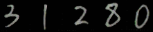

# figocr

#### 执行
```bash
python src/main.py --model=src/model/ocr2.pth --image=examples/31280.png
```
#### 输出
```
INFO:root:model loaded from src/model/ocr2.pth
INFO:root:3------1-2-8-0------
31280
```
